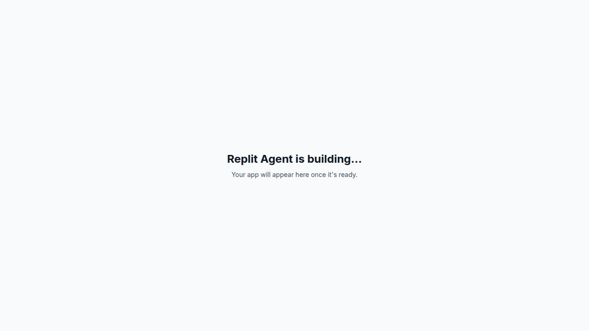
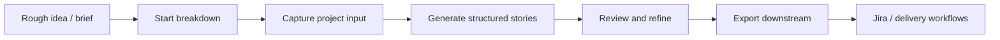
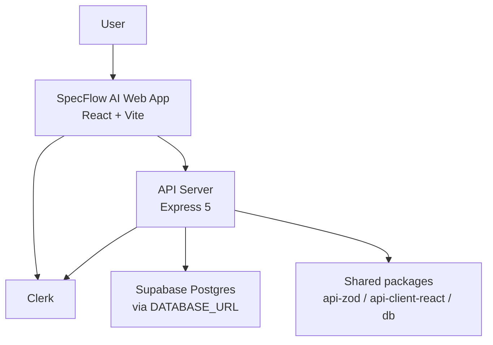
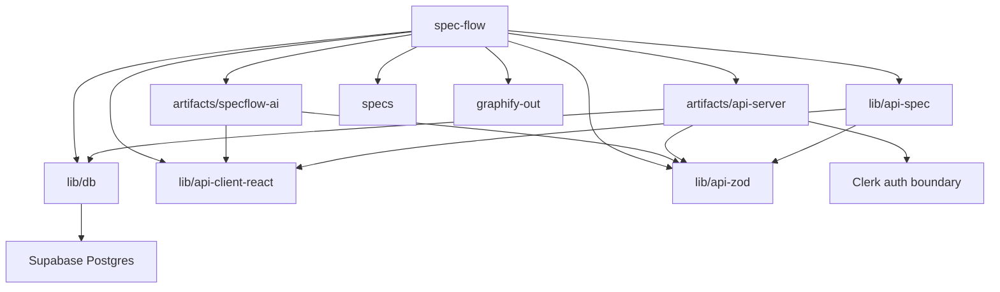
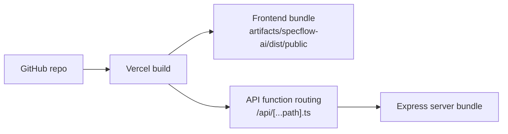

<div align="center">
  
  <h1>SpecFlow AI</h1>
  <p><strong>From rough idea to review-ready stories.</strong></p>
  <p>
    SpecFlow AI turns scattered product input into a guided workflow for
    breakdowns, structured stories, review, and export-ready handoff.
  </p>
  <p>
    <a href="https://your-project.vercel.app"><strong>Visit Website</strong></a>
    ·
    <a href="#what-it-does">What it does</a>
    ·
    <a href="#tech-stack">Tech stack</a>
    ·
    <a href="#project-graph">Project graph</a>
    ·
    <a href="#local-development">Local development</a>
  </p>
  <p>
    
    
    
    
    
    
  </p>
</div>

---



## What This Repo Is

SpecFlow AI is a product workflow app for teams that need better structure
between messy product ideas and downstream delivery tools.

This repository contains:

- Public landing experience for explaining the product and routing users into the app
- Authenticated web app for running breakdown workflows
- Express API server for auth-scoped application behavior
- Shared API contracts and generated client packages
- Shared database schema package for the Supabase-hosted Postgres runtime

## What It Does

SpecFlow AI helps a team move through one clear path:

1. Start a breakdown from a rough idea, brief, or notes.
2. Capture project input like goals, users, labels, and constraints.
3. Generate structured stories and workflow artifacts.
4. Review, refine, and tighten quality before handoff.
5. Export clean output for downstream delivery workflows.

## Why It Exists

Product context usually fragments across docs, chat, tickets, and ad hoc
handoffs. SpecFlow AI keeps the workflow in one place so product, design, and
engineering can work from the same source of truth.

## Website

> Replace `https://your-project.vercel.app` below with the production URL if it differs.

- Live app: [https://your-project.vercel.app](https://your-project.vercel.app)
- Local app: [http://localhost:8080](http://localhost:8080)
- Local API: [http://127.0.0.1:24549](http://127.0.0.1:24549)

## Product Flow



## Architecture



## Tech Stack

| Layer | Tech |
| --- | --- |
| Frontend | React, Vite, TypeScript, Wouter, TanStack Query, Tailwind CSS, Radix UI, Framer Motion |
| Backend | Express 5, TypeScript, Pino, CORS, Cookie Parser |
| Auth | Clerk React, Clerk Express |
| Data | Supabase Postgres, Drizzle ORM, Zod, drizzle-zod |
| Shared Contracts | OpenAPI, generated API client, generated Zod types |
| Tooling | pnpm workspace, TypeScript project refs, Prettier, Graphify |
| Deploy | Vercel for frontend/runtime routing |

## Monorepo Structure

```text
.
├── artifacts/
│   ├── specflow-ai/        # React + Vite product app and landing page
│   ├── api-server/         # Express API server
│   └── mockup-sandbox/     # UI sandbox surface
├── lib/
│   ├── api-spec/           # OpenAPI source
│   ├── api-client-react/   # Generated API client
│   ├── api-zod/            # Generated Zod contracts
│   └── db/                 # Drizzle schema and DB scripts
├── specs/                  # Product specs and implementation plans
├── scripts/                # Workspace utilities
└── graphify-out/           # Project knowledge graph artifacts
```

## Project Graph



## Core Repo Areas

| Path | Function |
| --- | --- |
| `artifacts/specflow-ai` | Main product UI, landing page, dashboard, workflow workspace |
| `artifacts/api-server` | API routes, auth context, persistence orchestration |
| `lib/db` | Database schema, connection setup, Supabase hardening scripts |
| `lib/api-spec` | OpenAPI contract source |
| `lib/api-client-react` | Typed frontend API client |
| `lib/api-zod` | Shared generated request and response schemas |
| `specs` | Execution plans, feature specs, research, and implementation context |
| `graphify-out` | Knowledge graph report and generated graph artifacts |

## Local Development

### Requirements

- Node.js 24
- pnpm 10

### Environment

Create `.env` from `.env.example` and set:

- `CLERK_PUBLISHABLE_KEY`
- `VITE_CLERK_PUBLISHABLE_KEY`
- `CLERK_SECRET_KEY`
- `DATABASE_URL`
- `VITE_APP_URL`
- `VITE_API_SERVER_URL`
- optional `API_SERVER_URL`
- optional `APP_ALLOWED_ORIGINS`
- optional `INTEGRATION_SECRET_ENCRYPTION_KEY`

### Start Everything

```bash
pnpm install
pnpm dev
```

Open `http://localhost:8080/`.

`pnpm dev` starts both:

- `@workspace/specflow-ai` on `PORT=8080`
- `@workspace/api-server` on `PORT=24549`

### Other Targets

```bash
pnpm dev:specflow
pnpm dev:api
pnpm dev:mockup
```

## Security Notes

- Clerk owns sign-in and session tokens.
- Express is the application authorization boundary.
- Supabase is used as Postgres through `DATABASE_URL`.
- Browser `SUPABASE_` env vars are not part of the active runtime path.
- Public Supabase tables should stay locked down because app access goes through the API.

### Supabase Hardening

Apply public-schema hardening:

```bash
pnpm --filter @workspace/db secure:supabase
```

Audit RLS and grants:

```bash
pnpm --filter @workspace/db audit:supabase
```

## Deploy Shape



Repo root `vercel.json` builds both the frontend and API server, serves the
frontend from `artifacts/specflow-ai/dist/public`, and routes `/api/*` to the
bundled server entry.

## Useful Commands

```bash
pnpm dev
pnpm build
pnpm typecheck
pnpm --filter @workspace/specflow-ai typecheck
pnpm --filter @workspace/api-server typecheck
pnpm --filter @workspace/db secure:supabase
pnpm --filter @workspace/db audit:supabase
graphify update .
```

## Graphify

This repo ships with Graphify artifacts under `graphify-out/`.

- Read `graphify-out/GRAPH_REPORT.md` for high-level codebase structure
- Use `graphify update .` after code changes to refresh the graph
- Treat `graphify-out` as architecture support, not handwritten docs

## Status

SpecFlow AI currently combines:

- Public product storytelling
- Authenticated breakdown workflows
- Shared typed contracts
- Supabase-backed persistence
- Export-oriented delivery prep

If you want this README to point at the real production website, replace the
placeholder `https://your-project.vercel.app` links with your live domain.
