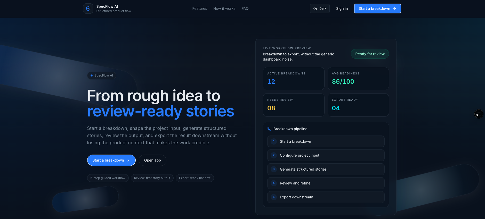
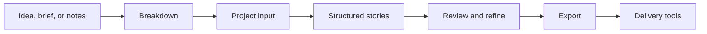
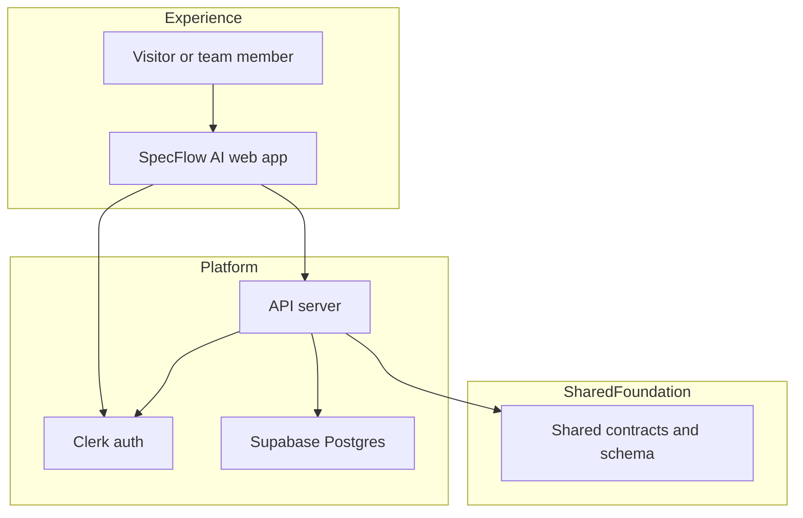
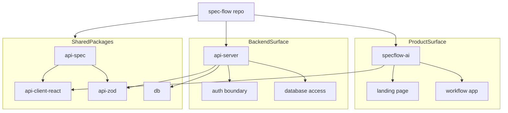

<div align="center">
  
  <h1>SpecFlow AI</h1>
  <p><strong>From rough idea to review-ready stories.</strong></p>
  <p>
    SpecFlow AI turns scattered product input into a guided workflow for
    breakdowns, structured stories, review, and export-ready handoff.
  </p>
  <p>
    <a href="https://spec-flow-ai.vercel.app/"><strong>Visit Website</strong></a>
    ·
    <a href="#what-it-does">What it does</a>
    ·
    <a href="#tech-stack">Tech stack</a>
    ·
    <a href="#project-graph">Project graph</a>
    ·
    <a href="#documentation">Documentation</a>
    ·
    <a href="#local-development">Local development</a>
  </p>
  <p>
    
    
    
    
    
    
  </p>
</div>

---



## At A Glance

| For | Does |
| --- | --- |
| Product teams | Turns rough ideas into a guided breakdown workflow |
| Design and engineering | Keeps scope, stories, and review context aligned |
| Delivery handoff | Prepares cleaner export-ready output for downstream tools |

## What This Repo Is

SpecFlow AI is a product workflow app for teams that need better structure
between messy product ideas and downstream delivery tools.

This repository contains:

- Public landing experience for explaining the product and routing users into the app
- Authenticated web app for running breakdown workflows
- Express API server for auth-scoped application behavior
- Shared API contracts and generated client packages
- Shared database schema package for the Supabase-hosted Postgres runtime
- Repo-owned docs in `docs/`

## What It Does

SpecFlow AI helps a team move through one clear path:

1. Start a breakdown from a rough idea, brief, or notes.
2. Capture project input like goals, users, labels, and constraints.
3. Generate structured stories and workflow artifacts when BYOK AI is enabled.
4. Keep the flow usable in manual mode when no provider key is configured.
5. Review, refine, and tighten quality before handoff.
6. Export clean output for downstream delivery workflows.

## Why It Exists

Product context usually fragments across docs, chat, tickets, and ad hoc
handoffs. SpecFlow AI keeps the workflow in one place so product, design, and
engineering can work from the same source of truth.

## Website

- Live app: [https://spec-flow-ai.vercel.app/](https://spec-flow-ai.vercel.app/)

## Product Flow



## Architecture



## Tech Stack

| Layer | Tech |
| --- | --- |
| Frontend | React, Vite, TypeScript, Wouter, TanStack Query, Tailwind CSS, Radix UI, Framer Motion |
| Backend | Express 5, TypeScript, Pino, CORS, Cookie Parser |
| Auth | Clerk React, Clerk Express |
| Data | Supabase Postgres, Drizzle ORM, Zod, drizzle-zod |
| Shared Contracts | OpenAPI, generated API client, generated Zod types |
| Tooling | pnpm workspace, TypeScript project refs, Prettier, Graphify |
| Deploy | Vercel for frontend/runtime routing |

## Repo Structure

```text
.
├── artifacts/specflow-ai   # product app and landing page
├── artifacts/api-server    # backend API
├── lib                     # shared contracts, client, and database package
├── specs                   # product and implementation documents
└── graphify-out            # generated architecture graph
```

## Project Graph



## Documentation

- [Overview](docs/overview.md)
- [Architecture](docs/architecture.md)
- [Tech Stack](docs/tech-stack.md)
- [Project Structure](docs/project-structure.md)
- [Local Development](docs/local-development.md)
- [Key Flows](docs/key-flows.md)
- [Onboarding](docs/onboarding.md)
- [AI Agent Guide](docs/ai-agent-guide.md)
- [Manus Project Brief](docs/manus/project-brief.md)
- [Manus Spec Index](docs/manus/spec-index.md)
- [Team Decisions](docs/team-decisions/README.md)

## Main Areas

- `artifacts/specflow-ai`: public site and authenticated product experience
- `artifacts/api-server`: backend behavior, auth-aware routes, persistence
- `lib`: shared contracts, generated client, and database package
- `docs`: repo-owned documentation
- `specs`: plans, feature definitions, and product context

## Local Development

### Requirements

- Node.js 24
- pnpm 10

### Environment

Create `.env` from `.env.example`.

### Start Everything

```bash
pnpm install
pnpm dev
```

Open local app in browser after start.

Fresh workspaces start empty until you create a breakdown. No demo project data is seeded into a new account.

### Other Targets

```bash
pnpm dev:specflow
pnpm dev:api
pnpm dev:mockup
```

## Security Note

This README intentionally avoids real secrets, database connection values,
private tokens, project keys, and internal environment data.

### Supabase Hardening

Apply public-schema hardening:

```bash
pnpm --filter @workspace/db secure:supabase
```

Audit RLS and grants:

```bash
pnpm --filter @workspace/db audit:supabase
```

## Useful Commands

```bash
pnpm dev
pnpm build
pnpm typecheck
pnpm --filter @workspace/specflow-ai typecheck
pnpm --filter @workspace/db secure:supabase
pnpm --filter @workspace/db audit:supabase
graphify update .
```

## Status

SpecFlow AI currently combines:

- Public product storytelling
- Authenticated breakdown workflows
- Shared typed contracts
- Supabase-backed persistence
- Export-oriented delivery prep

SpecFlow AI live site:
[https://spec-flow-ai.vercel.app/](https://spec-flow-ai.vercel.app/)

## Apex Yard portfolio snapshot

- Status: showcase
- Category: Tools
- Source of truth: [docs/portfolio.json](docs/portfolio.json)

This section is maintained from repository evidence and should be updated with docs/portfolio.json when the project changes.
