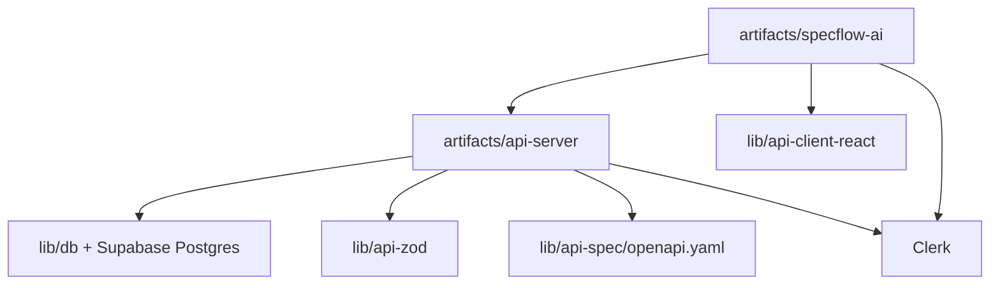

# Architecture

## Summary

The app is split into a React/Vite frontend, an Express API, and shared
contract/database packages. The UI drives workflow state, the API owns
auth-scoped persistence and generation, and the shared packages keep client,
schema, and server types aligned.

## Main Modules

| Module | Responsibility |
|---|---|
| `artifacts/specflow-ai/src/App.tsx` | Top-level routing, auth gating, and app shell selection |
| `artifacts/specflow-ai/src/pages/` | Landing, dashboard, workflow, review, export, and settings pages |
| `artifacts/specflow-ai/src/store/session-store.tsx` | Session state and workflow actions in the UI |
| `artifacts/api-server/src/server.ts` | Server startup and workspace schema bootstrap |
| `artifacts/api-server/src/routes/` | Health, auth, projects, sessions, generation, settings, export, and integration routes |
| `artifacts/api-server/src/ai/` | Deterministic workflow logic and prompt/config support |
| `lib/api-spec/openapi.yaml` | Source contract for API code generation |
| `lib/api-zod/src/generated/` | Generated Zod schemas and shared types |
| `lib/api-client-react/src/generated/` | Generated client used by the React app |
| `lib/db/src/schema/index.ts` | Shared database schema and persisted workflow types |

## Data / Control Flow

1. The browser enters through `artifacts/specflow-ai/src/App.tsx`.
2. Auth gates the app and the workspace shell loads the current session.
3. Workflow actions call the API through the generated client.
4. The API validates input, persists artifacts, and updates generation state.
5. Shared schema and client packages keep the API and UI contract aligned.
6. Exports read persisted state instead of rebuilding from only live UI state.

## External Services

- Clerk
- Supabase Postgres
- Vercel
- Jira and GitHub integration surfaces, with configuration state still needing
  verification in each deployment

## Diagram

## Risks / Coupling

- Generated packages must stay in sync with `lib/api-spec/openapi.yaml`
- `artifacts/api-server/src/routes/generation.ts` and
  `lib/db/src/schema/index.ts` are the highest-risk coupling points
- Auth, workspace IDs, and persistence are tightly linked across UI and API
- `graphify-out/` is useful for navigation but is generated, not source
