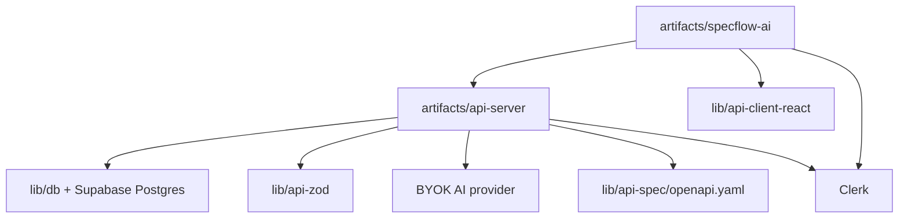

# Architecture

## Summary

The app is split into a React/Vite frontend, an Express API, and shared
contract/database packages. The UI drives workflow state, the API owns
auth-scoped persistence and generation, and the shared packages keep client,
schema, and server types aligned.

## Main Modules

| Module | Responsibility |
|---|---|
| `artifacts/specflow-ai/src/App.tsx` | Top-level routing, auth gating, and app shell selection |
| `artifacts/specflow-ai/src/pages/` | Landing, dashboard, workflow, review, export, and settings pages |
| `artifacts/specflow-ai/src/store/session-store.tsx` | Session state and workflow actions in the UI |
| `artifacts/api-server/src/server.ts` | Server startup and workspace schema bootstrap |
| `artifacts/api-server/src/routes/` | Health, auth, projects, sessions, generation, settings, AI provider, export, and integration routes |
| `artifacts/api-server/src/ai/` | Provider config, live provider calls, deterministic helpers, and prompt support |
| `lib/api-spec/openapi.yaml` | Source contract for API code generation |
| `lib/api-zod/src/generated/` | Generated Zod schemas and shared types |
| `lib/api-client-react/src/generated/` | Generated client used by the React app |
| `lib/db/src/schema/index.ts` | Shared database schema and persisted workflow types |

## Data / Control Flow

1. The browser enters through `artifacts/specflow-ai/src/App.tsx`.
2. Auth gates the app and the workspace shell loads the current session.
3. Workflow actions call the API through the generated client.
4. AI generation first checks workspace BYOK capability from the API capability
   endpoint.
5. In manual mode, the workflow still continues, but generation falls back to
   manual behavior and artifacts remain editable.
6. In AI-enabled mode, the API decrypts the workspace provider key and
   endpoint server-side, calls the provider, validates output, persists
   artifacts, and updates generation state.
7. The UI reads one shared capability model for labels, button states, and
   skill edit access instead of re-deriving provider truth ad hoc.
8. Shared schema and client packages keep the API and UI contract aligned.
9. Exports read persisted state instead of rebuilding from only live UI state.

## External Services

- Clerk
- Supabase Postgres
- Vercel
- OpenAI-compatible BYOK provider calls from the API server
- Jira and GitHub integration surfaces, with configuration state still needing
  verification in each deployment

## Diagram

## Risks / Coupling

- Generated packages must stay in sync with `lib/api-spec/openapi.yaml`
- `artifacts/api-server/src/routes/generation.ts` and
  `lib/db/src/schema/index.ts` are the highest-risk coupling points
- AI provider keys must stay server-only and must never be returned to browser
  payloads, logs, session artifacts, or workspace settings
- Provider endpoint changes are stored alongside the key so validation and
  generation always use the same workspace capability truth
- Empty workspaces should not be seeded with demo projects or fixed IDs; the
  UI should handle the empty-state path directly
- Auth, workspace IDs, and persistence are tightly linked across UI and API
- `graphify-out/` is useful for navigation but is generated, not source
